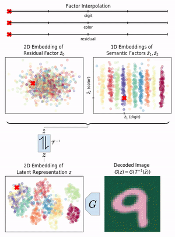

# A Disentangling Invertible Interpretation Network for Explaining Latent Representations

PyTorch code accompanying the [CVPR 2020](http://cvpr2020.thecvf.com/) paper

[**A Disentangling Invertible Interpretation Network for Explaining Latent Representations**](https://compvis.github.io/iin/)<br/>
[Patrick Esser](https://github.com/pesser)\*,
[Robin Rombach](https://github.com/rromb)\*,
[Björn Ommer](https://hci.iwr.uni-heidelberg.de/Staff/bommer)<br/>
\* equal contribution

<br/>
[arXiv](https://arxiv.org/abs/2004.13166) | [BibTeX](#bibtex) | [Project Page](https://compvis.github.io/iin/)


Table of Contents
=================

* [Requirements](#requirements)
* [Data](#data)
* [Training](#training)
   * [Autoencoders](#autoencoders)
   * [Invertible Interpretation Networks](#invertible-interpretation-networks)
      * [Unsupervised](#unsupervised)
      * [Supervised](#supervised)
* [Evaluation](#evaluation)
* [Pretrained Models](#pretrained-models)
* [Results](#results)
* [BibTeX](#bibtex)


## Requirements
A suitable [conda](https://conda.io/) environment named `iin` can be created
and activated with:

```
conda env create -f environment.yaml
conda activate iin
```

Optionally, you can then also `conda install tensorflow-gpu=1.14` to speed up
FID evaluations.


## Data
`MNIST`, `FashionMNIST` and `CIFAR10` will be downloaded automatically the
first time they are used and `CelebA` will prompt you to download it. The
content of each dataset can be visualized with

```
edexplore --dataset iin.data.<dataset>
```

where `<dataset>` is one of `MNISTTrain`, `MNISTTest`, `FashionMNISTTrain`,
`FashionMNISTTest`, `CIFAR10Train`, `CIFAR10Test`, `CelebATrain`, `CelebATest`,
`FactorCelebATrain`, `FactorCelebATest`, `ColorfulMNISTTrain`,
`ColorfulMNISTTest`, `SingleColorfulMNISTTrain`, `SingleColorfulMNISTTest`.


## Training

### Autoencoders
To train autoencoders, run

```
edflow -b configs/<dataset>_ae.yaml -t
```

where `<dataset>` is one of `mnist`, `fashionmnist`, `cifar`, `celeba`,
`cmnist`. To enable logging to [wandb](https://wandb.ai), adjust
`configs/project.yaml` and add it to above command:

```
edflow -b configs/<dataset>_ae.yaml configs/project.yaml -t
```

### Invertible Interpretation Networks
#### Unsupervised
To train unsupervised invertible interpretation networks, run

```
edflow -b configs/<dataset>_iin.yaml [configs/project.yaml] -t
```

where `<dataset>` is one of `mnist`, `fashionmnist`, `cifar`, `celeba`. If,
instead of using one of the [pretrained models](#pretrained-models), you
trained an autoencoder yourself, adjust the `first_stage` config section
accordingly.

#### Supervised
For supervised, disentangling IINs, run

```
edflow -b configs/<dataset>_diin.yaml [configs/project.yaml] -t
```

where `<dataset>` is one of `cmnist`, `celeba`.


## Evaluation

Evaluations run automatically after each epoch of training. To start an
evaluation manually, run

```
edflow -p logs/<log_folder>/configs/<config>.yaml
```

and, optionally, add `-c <path to checkpoint>` to evaluate a specific
checkpoint instead of the last one.


## Pretrained Models
To download (~2.2 GB) and extract pretrained models, run

```
wget --trust-server-names https://heibox.uni-heidelberg.de/f/ef7566f564dc42858b90/?dl=1
tar xzf logs.tar.gz
```


## Results
Using spectral normalization for the discriminator, this code slightly improves
upon the values reported in Tab. 2 of the paper.

| Dataset      | Checkpoint | FID    |
|--------------|------------|--------|
| MNIST        | 105600     | 5.252  |
| FashionMNIST | 110400     | 9.663  |
| CelebA       | 84643      | 19.839 |
| CIFAR10      | 32000      | 38.697 |

Full training logs can be found on [Weights &
Biases](https://app.wandb.ai/trex/iin/reportlist).


## BibTeX

```
@inproceedings{esser2020invertible,
  title={A Disentangling Invertible Interpretation Network for Explaining Latent Representations},
  author={Esser, Patrick and Rombach, Robin and Ommer, Bj{\"o}rn},
  booktitle={Proceedings of the IEEE Conference on Computer Vision and Pattern Recognition},
  year={2020}
}
```
